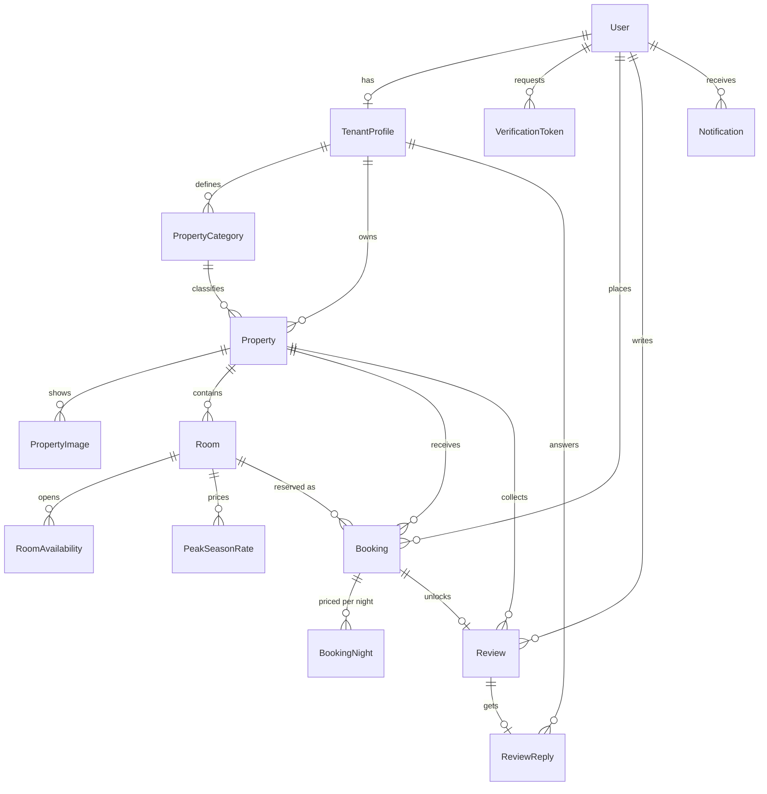
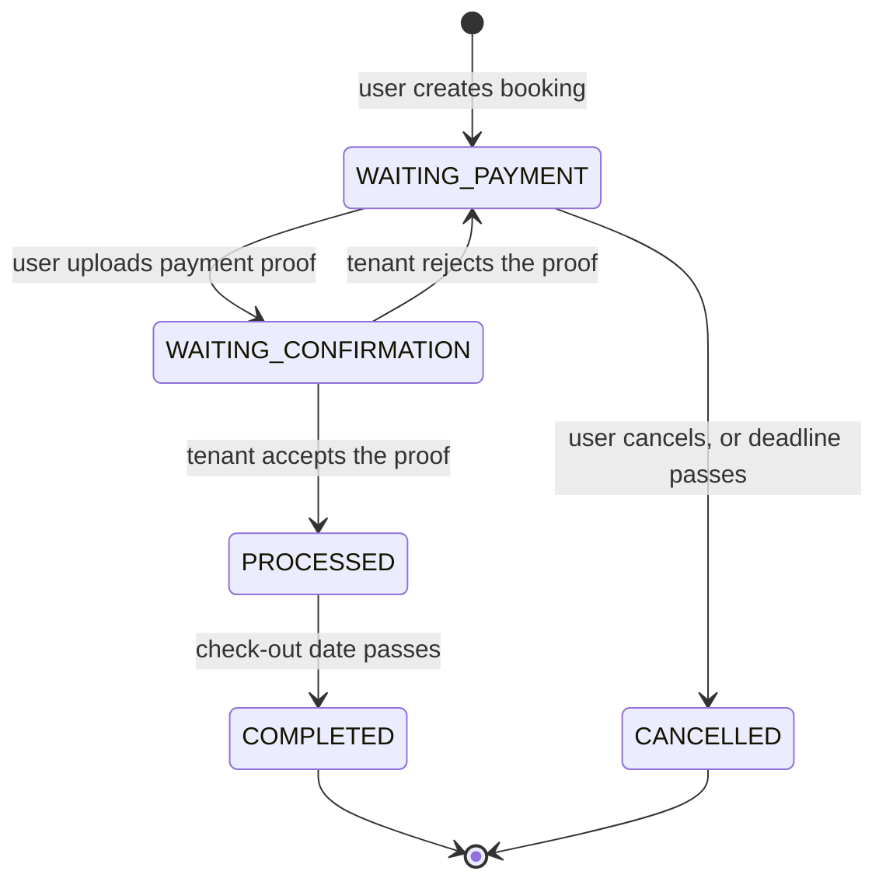

# Data model

Source of truth: [`apps/api/prisma/schema.prisma`](../apps/api/prisma/schema.prisma).

## Design decisions worth knowing

**`BookingNight` stores a price snapshot per night.** A booking does not recompute its total
from the current base price. Each night keeps `basePrice`, `finalPrice` and the peak season
rate name that applied. Two things fall out of this: a tenant editing prices later never
rewrites history, and the sales report is a straight aggregation over nights instead of a
recomputation.

**`RoomAvailability` stores exceptions, not every day.** A missing row means the room is
bookable at its default `totalUnits`. Tenants only persist the dates they explicitly block or
re-size, so the table stays small.

**Remaining capacity is derived, never stored.** Availability for a night is
`availableUnits (or totalUnits) - bookings holding that night`. Storing a counter would drift
the moment a booking auto-cancels.

**`VerificationToken` covers three flows.** Email verification, password reset and email
change share one table, separated by `type`. Only the SHA-256 digest of the token is stored.
`expiresAt` enforces the one-hour rule and `usedAt` enforces single use.

**Soft deletes on `User`, `Property`, `Room` and `PropertyCategory`.** Bookings reference
properties and rooms, so a hard delete would destroy transaction history. Queries filter on
`deletedAt: null`.

## Order status flow

Cancellation rules from the spec: a user may only cancel before uploading payment proof, and
a tenant may only cancel while no proof has been uploaded. `CancelledBy` records whether the
user, the tenant or the expiry job ended the booking.
