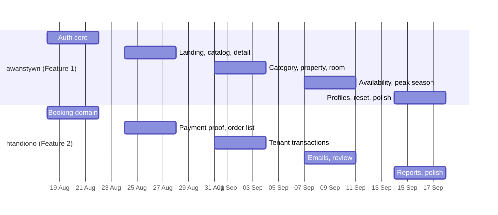

# Sprint plan

Five sprints of four working days each, then a review week. 17 August 2026 is Independence
Day, so Sprint 1 opens on Tuesday 18 August - the same day as the initial commit.

| Sprint    | Dates                  | Milestone due |
| --------- | ---------------------- | ------------- |
| Sprint 1  | Tue 18 - Fri 21 Aug    | 21 Aug 2026   |
| Sprint 2  | Mon 24 - Thu 27 Aug    | 27 Aug 2026   |
| Sprint 3  | Mon 31 Aug - Thu 3 Sep | 3 Sep 2026    |
| Sprint 4  | Mon 7 - Thu 10 Sep     | 10 Sep 2026   |
| Sprint 5  | Mon 14 - Thu 17 Sep    | 17 Sep 2026   |
| Review    | Fri 18 - Wed 23 Sep    | 23 Sep 2026   |

Presentation follows the review week, with slides submitted the day before.

## Sequencing logic

Work is ordered so that whatever blocks the other person ships first.

Auth lands in Sprint 1 because every Feature 2 screen needs a signed-in user. The public
catalog and property detail land in Sprint 2 because the checkout flow starts from them.
Everything else is ordered by risk, with the reports and profile work last since neither
blocks the other person.

## Sprint 1 - foundations that unblock each other

**awanstywn** separate user and tenant registration, email verification with set-password
(single use, one-hour expiry), login and JWT issuing, refresh, route guards, role separation
with redirects and disabled states.

**htandiono** booking domain: availability check, per-night price calculation through
`pricing.service`, create-booking endpoint, order number generation, order status state
machine, and the auto-cancel job for unpaid bookings.

## Sprint 2 - the front door and the money trail

**awanstywn** landing page (navbar, hero carousel, destination dropdown, date and duration
and guest form, property list, footer), property catalog and search with server-side
pagination, filtering and sorting, property detail page with the monthly price calendar.

**htandiono** checkout flow from property detail, payment proof upload (.jpg/.png, max 1MB),
user order list with server-side pagination plus filter by status and search by date and
order number, and user-initiated cancellation.

## Sprint 3 - tenant CRUD and tenant transactions

**awanstywn** property category CRUD, property CRUD with image upload, room CRUD, and the
tenant property list showing nested rooms.

**htandiono** tenant order list grouped by status, confirm or reject payment proof with the
correct status transitions, notification to the user on acceptance, and tenant cancellation
with a confirmation dialog.

## Sprint 4 - pricing engine and post-stay

**awanstywn** room availability management, peak season rate management supporting both
nominal and percentage adjustments across a range or a single date, and wiring real pricing
into the detail calendar.

**htandiono** booking-confirmed email with booking detail and house rules, H-1 check-in
reminder job, and the review feature - one review per completed stay after check-out, with
tenant replies.

## Sprint 5 - reports, profiles, polish

**awanstywn** reset password (request and confirm pages, single use per request), user and
tenant profiles (update details, avatar with extension and size validation, email change with
re-verification, change password), Google social login, and a mobile-first responsive pass.

**htandiono** sales report grouped by property, transaction or user with a date-range filter
and sorting by date or total, the property availability calendar report, and a responsive
pass.

## Review week

Cross-review each other's pull requests, fix bugs, and run the standardization checklist:
every file under 200 lines, every function under 15 lines, no dead code or leftover logs,
server-side pagination everywhere, client and server validation on every input, title and
favicon set. Prepare the presentation slides and submit the final pull request into `main`.
